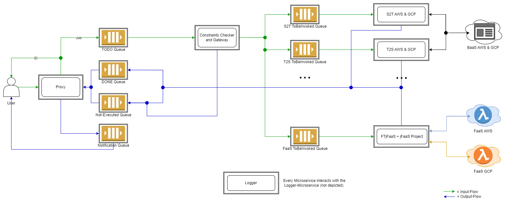

# *jInvoke*

## Details

| Title | ***jInvoke*: A Microservice-based Invoker for Serverless Tasks in Federated Clouds** |
| ----- | ----- | 
| Students | Thomas Mittermair | 
| Status | Initial presentation | 
| Description | Currently, several invokers for FaaS (Function as a Service) exist, also across multiple providers (e.g. the xAFCL Enactment Engine). However, the community lacks of an interoperable invoker that can invoke BaaS (Backend as a Service) services across multiple providers, such as AWS Transcribe (Speech to Text) and GCP Speech-to-Text, which offer the same service. A user might want to change the provider because of a cheaper, faster, or more accurate BaaS service. The goal of this bachelor thesis is to develop an interoperable invoker for any serverless task in federated clouds, regardless if it is for FaaS or BaaS. *jInvoke* handles requests for executing FaaS functions and BaaS services directly. Furthermore, *jInvoke* is build based on a microservice architecture, which means that it consists of different microservices that cooperate with each other with orchestration. The exact workflow is displayed as a flow diagram of the system architecture below. *jInvoke* will be integrated in the new xAFCL2 Enactment Engine based on microservices. The supported providers will be Amazon (AWS) and Google (GCP). The whole code is in Java. |
| Tasks | 1. Research the applicability of the microservice architecture.   2. Define the system architecture and communication interfaces.   3. Develop the individual microservices based on the architecture.   4. Integrate the orchestration of microservices with support for AWS and GCP, FaaS functions and several BaaS services.   5. Evaluate the latency and scalability of *jInvoke*. |
| Theoretical skills | Cloud Computing, Serverless | 
| Practical skills | Java, Cloud APIs |
---

## Example architecture

