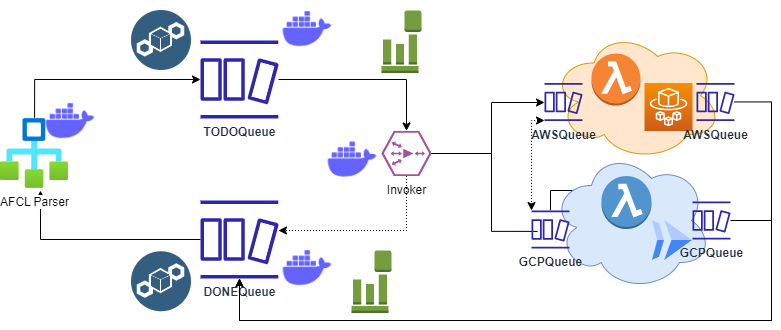

## *StreamAFCL*

## Details

| Title | ***StreamAFCL*: A novel serverless workflow management system for streaming AFCL workflows in federated FaaS ** |
| - | - | 
| Students | one or two | 
| Description | The current version of the xAFCL serverelss workflow management system is able to run a single AFCL serverless workflow at a time. In this thesis, the student will develop a novel StreamAFCL serverelss workflow management system based on a modern architecture including Docker containers, Streams, Event sourcing, and producer consumer paradigm. See the figure below (sketched high-level architecture). The system comprises four main parts *AFCL parser*, *TODOQueue*, *invoker*, and *DONEQueue*. An instance of the AFCL parser is started for each separated AFCL workflow that is running and it places all ready functions in the *TODOQueue*. The *invoker* is triggered after some time or amount of ready functions and invokes them. It should support both synchronous and asynchronous invocation. Finally, it (or another module) stores the finished function in the *DONEQueue*.
|Tasks| 1. Analyze the existing serverelss workflow management systems.   2. Design system architecture to meet both functional and non-functional requirements.   3. Design SW architecture.  4. Develop the system that supports ultiple clouds.  5. Evaluate the system with existing FCs.|
| Theoretical skills | Cloud Computing, Serverless. | 
| Practical skills | programming languages; Cloud APIs.|
| Related work| Please contact me for the current status of my research in this topic! |
---

## Example architecture

