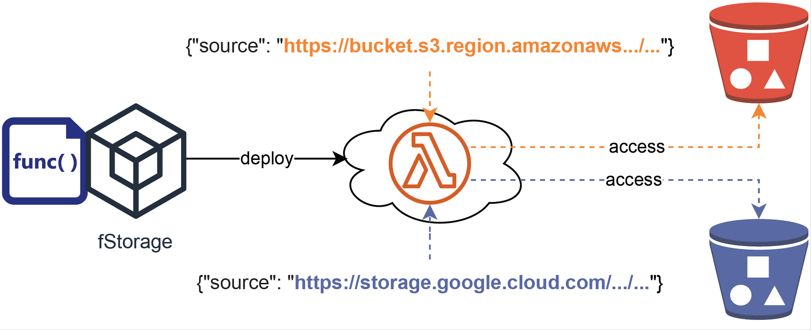

## *fServiceX*

## Details

| Title | ***fServiceX*: Code once serverless functions and dynamically select BaaS services in federated FaaS ** |
| - | - | 
| Students | one or two | 
| Description | Development of serverless functions that use multiple cloud services is a complex task as it may require huge development effort to integrate various libraries for each cloud service that the function uses. Recently, I supervised the bachelor thesis *fService: Configurable abstraction for serverless development* in which we established the main abstraction of cloud services through abstraction of AWS's and Google's storages and object recognition cloud services for java serverless functions. The library can be added as Maven dependency in Java functions. Further on, two other completed bachelor theses (*pyStorage* and *portableGo*), which extend the concept of *fService* for abstract storage in Python and Go. This bachelor thesis extends *fService* to support various programming languages (e.g., Java, node.js, Python, etc.) and various BaaS services (e.g., storage, object recognition, prediction, speech2text, text2speech, OCR, etc) of multiple cloud providers (e.g., AWS, Google, etc). Since each BaaS service usually accesses cloud storage, the library should be developed a top of the existing storage library (Java, Go, Python). Heuristics may be added to determine which specific cloud service to be used (e.g., Amazon Transcribe or Google SpeechtoText) based on the storage location of the audio file. 
|Tasks| 1. Define interfaces and methods for the selected cloud storages. For instance, copy(sourceURL, destURL), voice2text(sourceAudio, destText).  2. Develop implementations of interfaces for various cloud providers (e.g., AWS, Google, etc) and their abstracted services in selected programming language(s).   3. Build portable function choreography (*FC*) for a real-life application with dynamic inputs of serverless functions to specify the specific cloud service that they use (e.g. location of the input audio files).  4. (if two students) Develop a model for portable cloud services used by FC functions.  5. (if two students) Based on the model, develop a scheduler that updates the FC (function deployments and service deployments as data inputs) and optimize e.g., accuracy / cost / performance.  6. Evaluate the system with the developed FC and optimal selection of the proper cloud service.|
| Theoretical skills | Cloud Computing, Serverless. | 
| Practical skills | programming languages; Cloud APIs.|
| Related work| Please contact me for the current status of my research in this topic! |
---

## Example for fStorage

The figure below present my novel programming model for serverless workflows for the fStorage approach, where the function receives the URL of the bucket and dynamically selects the provider's storage from the URL. Similar approach will be used for the fService approach to dynamically select the used BaaS services.

We follow the design princip COREWE "Code Once, Run Everywhere, With Everything!"
